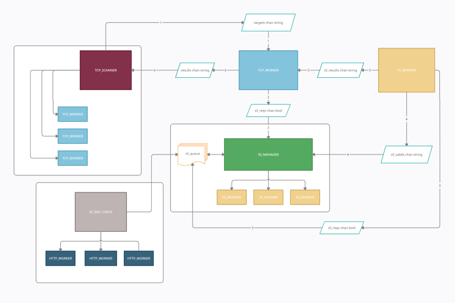

# Crimson Prober v1

> Alpha version of Asynchronous TCP scanner through SOCKS5 proxies

#### You can see on the flow chart below, what I wanted to achieve:
<p align="center">
  
</p>

# Installation
```
go install github.com/Karmaz95/crimson_prober@latest
```

# Running
```
ON VPS: ncat -lkvp <opened_port> --max-conns 2000
crimson_prober -a "<target_ip> -c "<vps_ip>:<closed_port>" -o "<vps_ip>:<opened_port>" -p 1-1000 -s "socks5_proxies.txt" 
```

##### Socks5 proxies source:
[List of socks5 proxies](https://proxyscrape.com/free-proxy-list)

##### [Medium article](https://karol-mazurek95.medium.com/better-service-discovery-de48dcbf2c9c)

Many thanks to my colleague [Piotr Madej](https://www.linkedin.com/in/piotr-madej-18b0bb38/), who inspired me to create the tool.  
He made a similar scanner for socks4 proxies in Python, available at this [link](https://github.com/piotr-madej/TCP-CONNECT-TOR-Scan).
